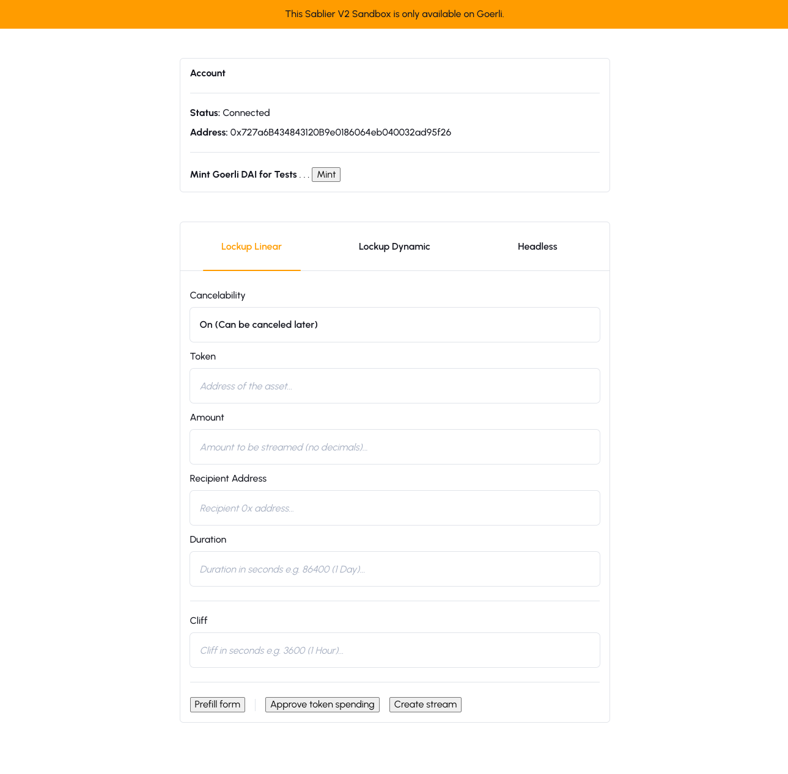
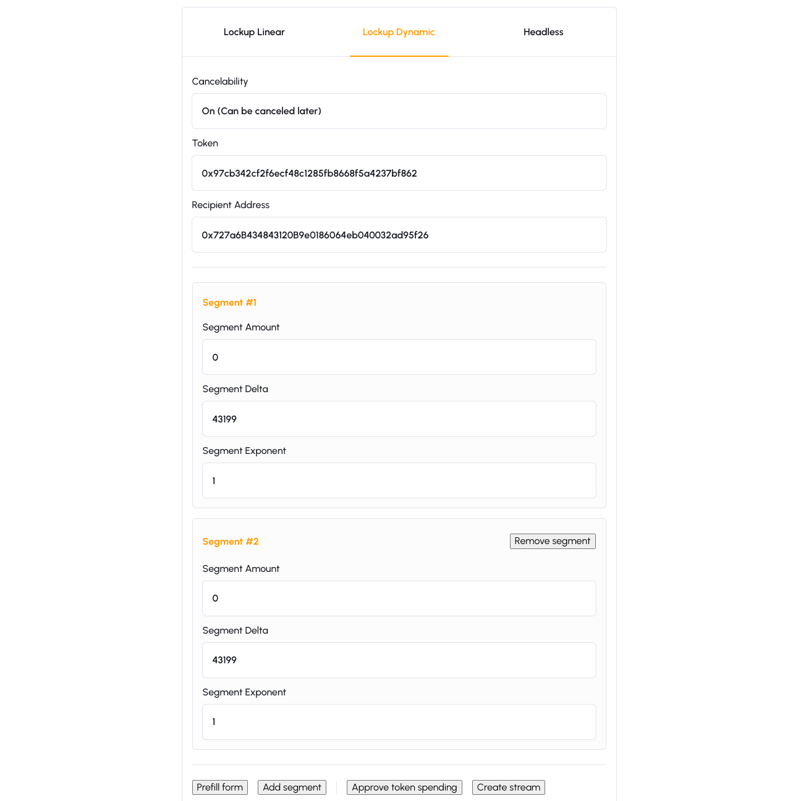
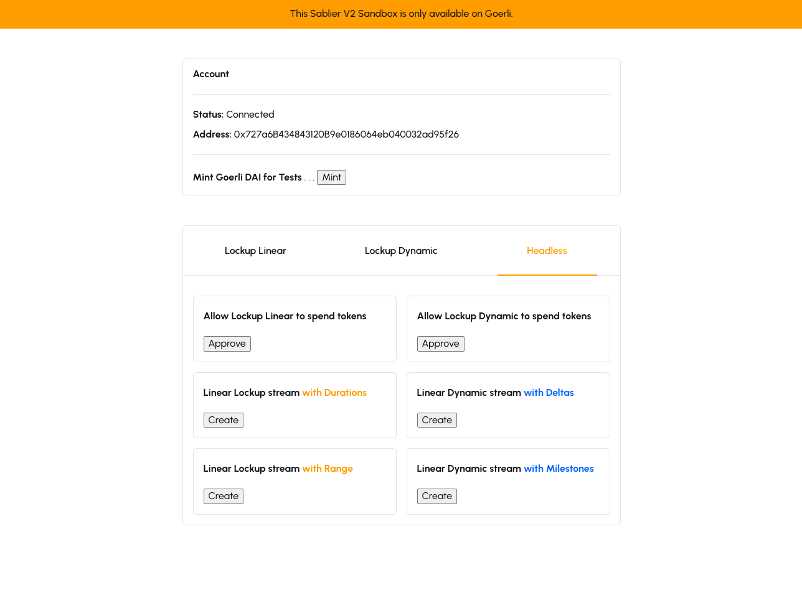
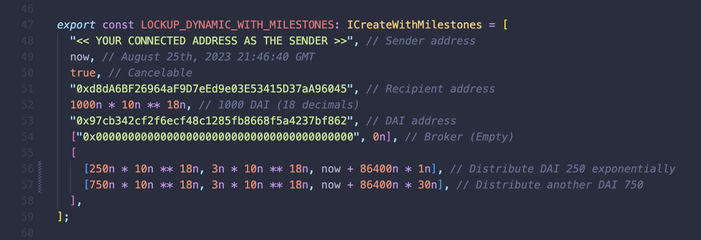
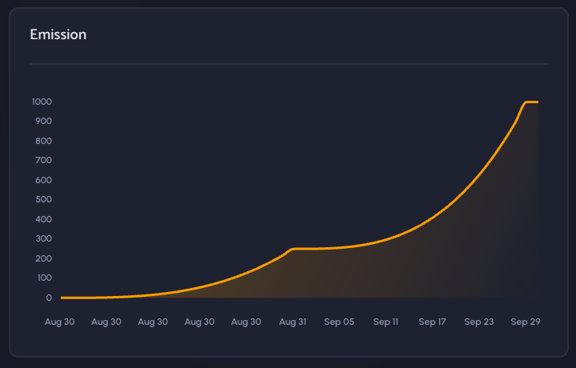

# Sablier V2 Sandbox

Front-end sandbox development environments for Sablier V2.

## Examples / Ethers V6

This sandbox environment showcases a frontend integration with the [Sablier V2](https://docs.sablier.com) **Core** contracts through [Ethers V6](https://docs.ethers.org/v6/). The small app will require a wallet connection (Injected / Metamask) to be established, using Goerli as a playground.

| Lockup Linear (Form)                | Lockup Dynamic (Form)                | Headless                             |
| ----------------------------------- | ------------------------------------ | ------------------------------------ |
|  |  |  |

### Features

**Lockup Linear = LL, Lockup Dynamic = LD**

- Create a LL stream with Durations using the UI Form
- Create a LD stream with Deltas using the UI Form
- Create a LL stream with Durations in headless mode (tweak durations in code)
- Create a LL stream with Range in headless mode (tweak dates/ranges in code)
- Create a LD stream with Deltas in headless mode (tweak deltas in code)
- Create a LD stream with Milestones in headless mode (tweak milestones in code)
- Mint testnet DAI tokens ([Goerli](https://goerli.etherscan.io/token/0x97cb342cf2f6ecf48c1285fb8668f5a4237bf862))
- Approve spending DAI tokens for both the LL and LD contracts

Most of the transaction magic happens inside [`models/Transaction.ts`](/examples/ethers-v6/src/models/Transaction.ts). Have a look to understand how parameters are formatted (strings to Big Int, padding numbers with decimals etc.) and sent to the contracts.

For the **headless** mode, head over to [`constants/data.ts`](/examples/ethers-v6/src/constants/data.ts). Here you'll be able to tweak the parameters to create streams of different values or shapes (segments).

#### Other features

In the UI Forms you may find `Prefill form` buttons. Clicking on them will add pre-configured data into the fields as an example of what the data should look like.

After you create a test stream, make sure to connect to our main [app.sablier.com](https://app.sablier.com) interface with your "sender" wallet to check out what the [stream actually looks like](https://docs.sablier.com/apps/features#detailed-panels).

| Payload (LD with two segments)            | Shape                                      |
| ----------------------------------------- | ------------------------------------------ |
|  |  |
